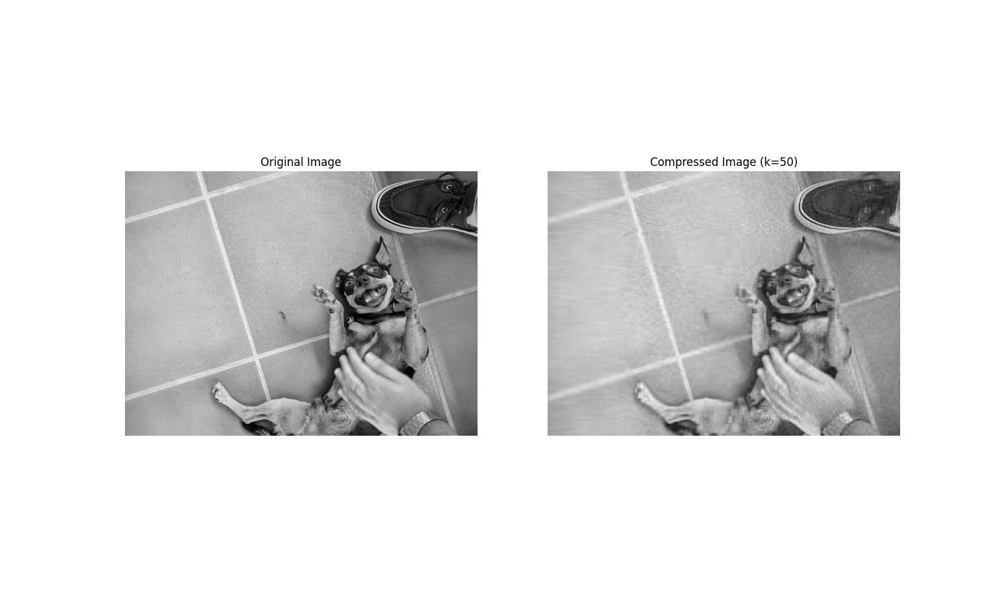

# Image-compression
Image compression with dimensionality reduction tecnics
Above there are two files, a .ipynb and a .py, the notebook version is a image compression using SVD (Singular Values Decomposition) with k=40, the .py file is a python program that take in input a filepath and return the plot like the .ipynb file, but with k=50.

